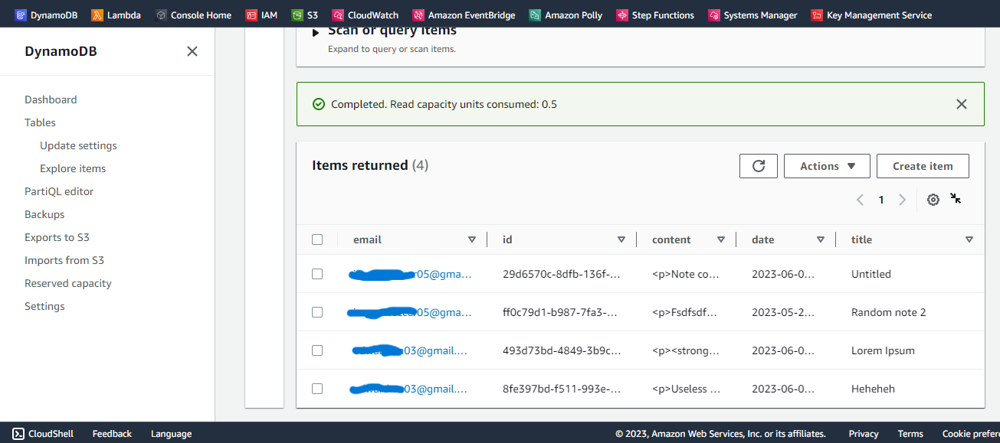

# Notes application

###### Group Project

###### Created by Edward An and Jacob Lever

This is a full stack application created with React and AWS that allows user login and authentication using `@react-oauth/google` (more info provided [here](https://blog.logrocket.com/guide-adding-google-login-react-app/)).

# Link to website

Website link is provided [here](https://eddies-note-application.netlify.app/).
Feel free to play around with the website.
Please note that:

- Google Authentication takes care of the login. Therefore, I do not have access to user information.
- However, I do have access to all the notes created in the DynamoDB database. Please do not create any notes with sensitive information in it.

Here is what the database looks like:

## Architecture Overview

 

  

 

## :page_with_curl: Notes

- All the resources on AWS is created with Terraform. The resource configuration is in the [`main.tf`](infra/main.tf) file
- Resources are created using the following commands in the directory containing [`main.tf`](infra/main.tf) file:
  - `terraform init`
  - `aws-vault exec {AWS username} --no-session -- terraform apply`
- AWS DynamoDB is used for the database
- Lambda Function URLs is used to connect your backend to the frontend
- There are 3 Lambda functions:

  - `get-notes`: to retrieve all the notes for a user. The function reads the user email from the query parameter `email`, and receives `email` and `access_token` (this is the token you get from the Google login library) in the headers. Function URL only allows `GET` requests
  - `save-note`: to save/create/update a note for a user. The function reads the note to be saved/created/updated from the body of the request, and receives `email` and `access_token` in the headers. Function URL only allows `POST` requests
  - `delete-note`: to delete an existing note for a user. The function reads the user email from the query parameter `email`, and receives `email` and `access_token` in the headers. Function URL only allows `DELETE` requests

- The `email` and `access_token` in the headers of the requests is used to make sure the user is authenticated properly. If not, the functions return the HTTP status code `401` for unauthenticated requests

## :moneybag: Cost

- For the AWS DynamoDB table, `PROVISIONED` billing mode, and only 1 RCU and WCU is used
- Memory configuration less than 128MB for AWS Lambda functions is used. When the `memory_size` field is not specified, it will default to 128MB which is the minimum amount
- 1 Million free requests, and up to 3.2 million seconds of free compute time is under the [Free Tier](https://aws.amazon.com/free/)
- Free Tier notifications on my AWS account is enabled to stay within the free tier

###### Note to self: Backend authentication still not complete. However, the website is still functional
